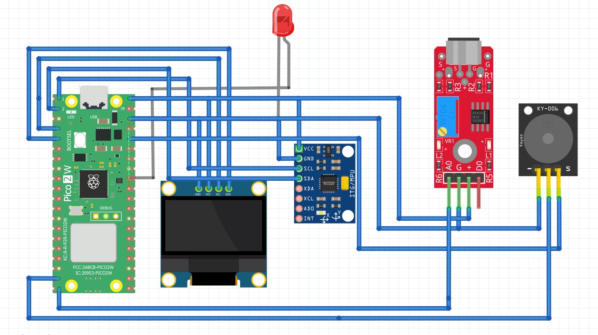
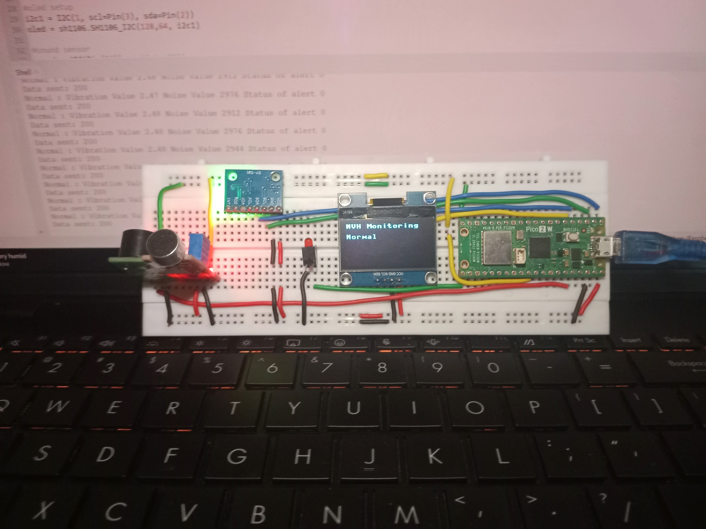
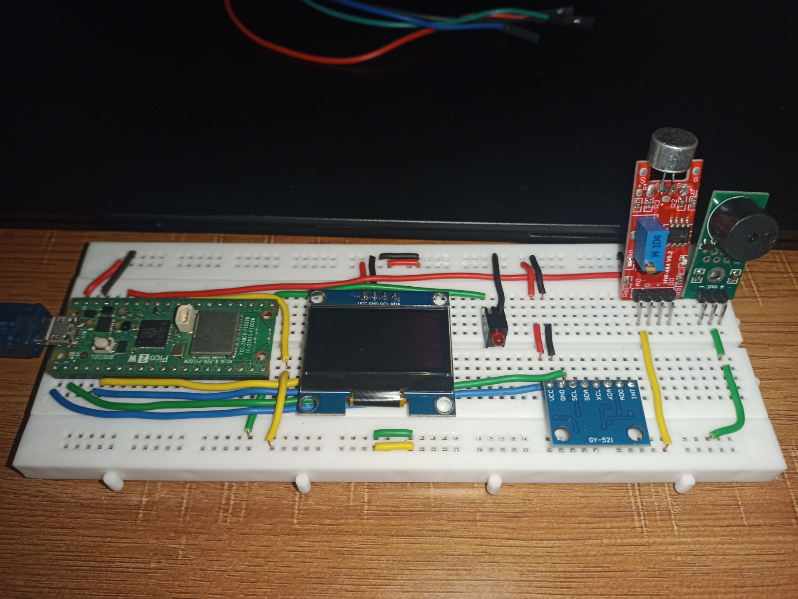
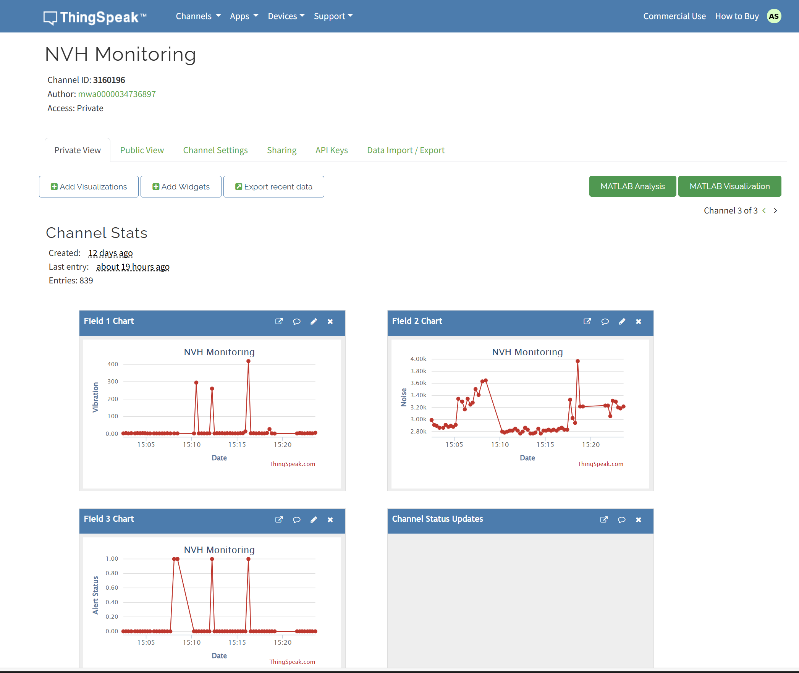
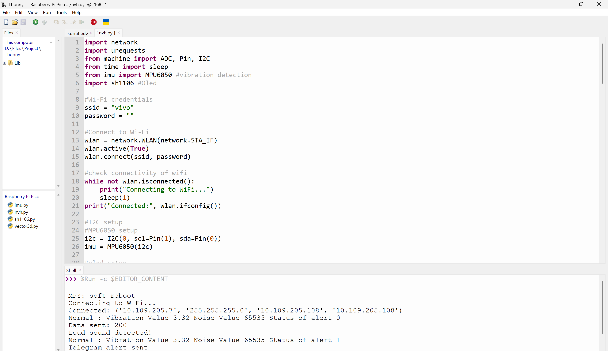
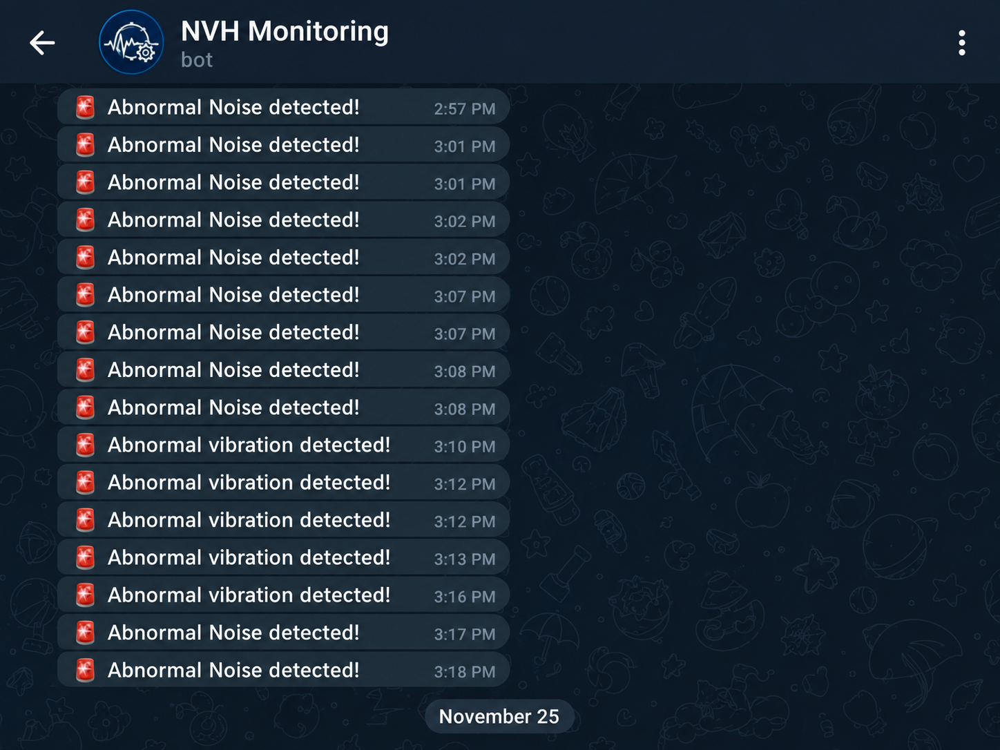
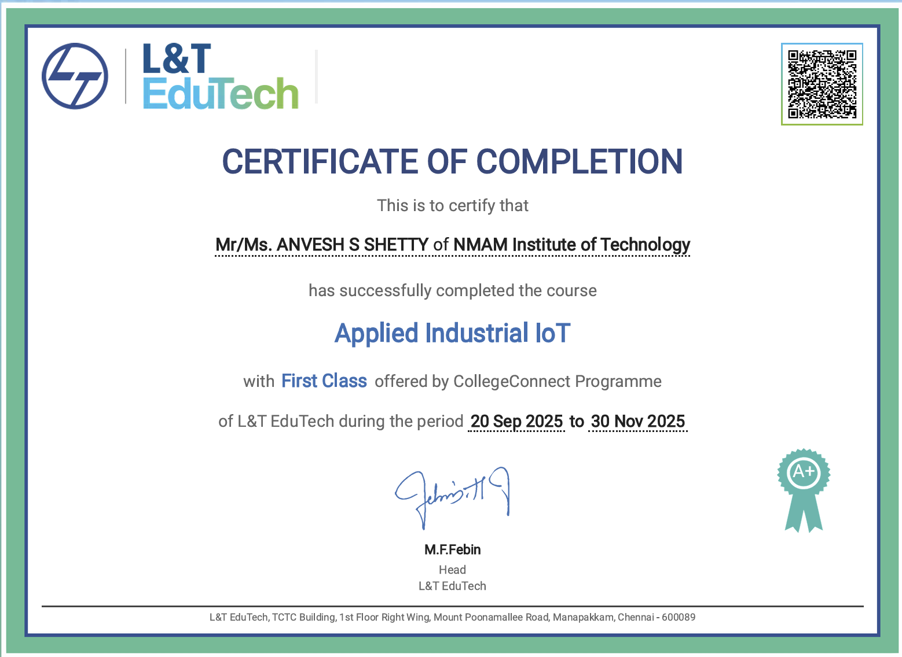
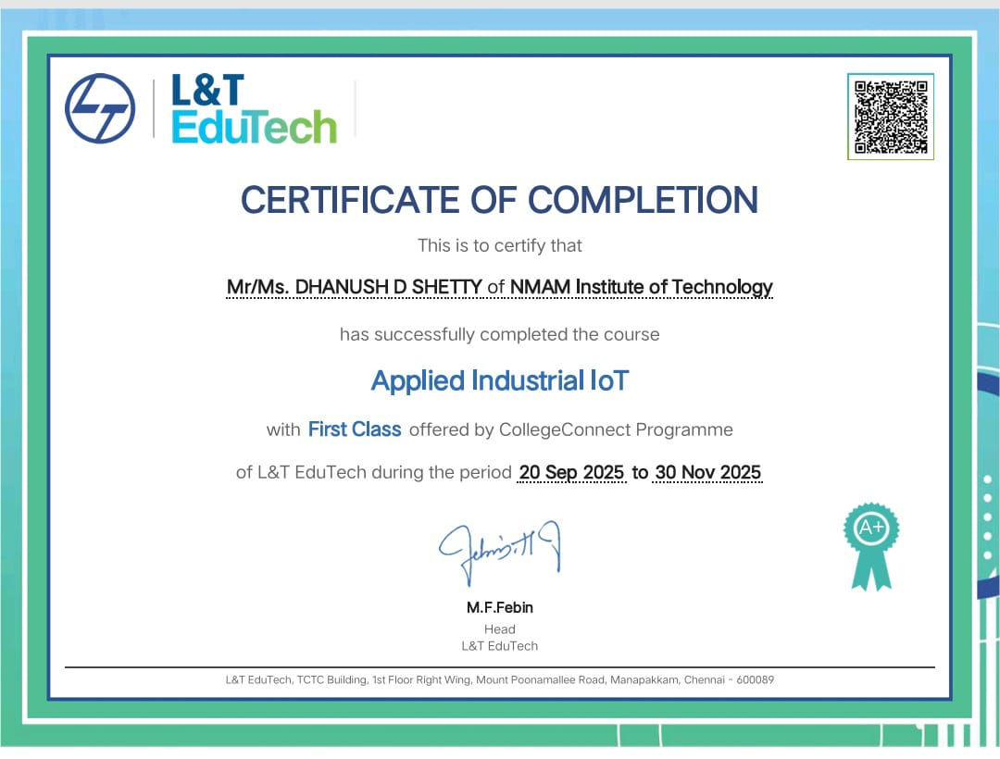

<div align="center">

# 🚀 IoT Machinery NVH Monitoring System

### Real-Time Noise, Vibration & Harshness Monitoring using Raspberry Pi Pico W

<p align="center">
An IoT-based monitoring system that continuously monitors machine vibration and noise levels, displays live data on an OLED display, uploads telemetry to ThingSpeak Cloud, and instantly sends Telegram alerts whenever abnormal operating conditions are detected.
</p>

---


</div>

---

# 📖 Project Overview

Industrial machines often exhibit abnormalities in the form of excessive **Noise**, **Vibration**, and **Harshness (NVH)** before developing major faults. Early detection of these abnormalities significantly reduces maintenance costs and prevents unexpected machine failures.

This project presents an **IoT-based NVH Monitoring System** developed using the **Raspberry Pi Pico W** and **MicroPython**. The system continuously monitors vibration and noise levels, displays live readings on an OLED display, uploads data to the **ThingSpeak Cloud**, and sends instant **Telegram notifications** whenever predefined thresholds are exceeded.

The system provides a low-cost, portable, and scalable solution suitable for predictive maintenance and industrial monitoring applications.

---

# ✨ Features

### 📊 Monitoring

- Real-time vibration monitoring
- Real-time noise monitoring
- Continuous sensor data acquisition
- Live machine status monitoring

---

### 🌐 IoT Features

- Wi-Fi Connectivity
- ThingSpeak Cloud Integration
- Remote Data Monitoring
- Telegram Alert Notifications

---

### 🖥 User Interface

- OLED Live Display
- Serial Monitor Output
- Status LED Indication
- Buzzer Alerts

---

### ⚙ Smart Features

- Threshold-based fault detection
- Automatic cloud updates
- Automatic alert generation
- Continuous monitoring loop

---

# 🛠 Hardware Components

| Component | Description |
|------------|-------------|
| Raspberry Pi Pico W | Main Controller |
| MPU6050 | Accelerometer & Gyroscope |
| Analog Sound Sensor | Noise Detection |
| SH1106 OLED Display | Live Data Display |
| Buzzer | Audible Alarm |
| LED | Visual Alert |
| Breadboard | Prototyping |
| Jumper Wires | Connections |
| USB Cable | Programming & Power |

---

# 💻 Software & Technologies

| Software | Purpose |
|-----------|----------|
| MicroPython | Programming Language |
| Thonny IDE | Development Environment |
| ThingSpeak | Cloud Platform |
| Telegram Bot API | Alert Notification |
| GitHub | Version Control |

---

# 📂 Repository Structure

```
NVH-Monitoring/
│
├── lib/
│   ├── imu.py
│   ├── sh1106.py
│   └── vector3d.py
│
├── Schematic/
│   ├── Certificate.jpg
│   ├── Circuit_on.jpg
│   ├── Circuit_off.jpg
│   ├── Circuit_Diagram.jpg
│   ├── Serial_Monitor.png
│   ├── ThingSpeak.png
│   ├── Telegram.png
│   └── Demo_Video.mp4
│
├── README.md
└── main.py
```

---

# ⚙ System Architecture

```
                 MPU6050
                    │
                    ▼
           Raspberry Pi Pico W
                    │
      ┌─────────────┼──────────────┐
      │             │              │
      ▼             ▼              ▼
 Sound Sensor   OLED Display    LED/Buzzer
      │
      ▼
   Threshold Detection
      │
      ▼
  Wi-Fi Connection
      │
      ▼
 ┌───────────────┐
 │ ThingSpeak    │
 └───────────────┘
      │
      ▼
 Telegram Notification
```

---

# 🔄 Project Workflow

```
Power ON
    │
    ▼
Initialize Sensors
    │
    ▼
Connect to Wi-Fi
    │
    ▼
Read Sensor Data
    │
    ▼
Display on OLED
    │
    ▼
Upload to ThingSpeak
    │
    ▼
Threshold Exceeded?
     │
 ┌───┴────┐
 │        │
No       Yes
 │        │
 ▼        ▼
Continue  Activate LED
          Activate Buzzer
          Send Telegram Alert
          Continue Monitoring
```

---

# 🎯 Applications

- Industrial Machinery Monitoring
- Predictive Maintenance
- Factory Automation
- Smart Manufacturing
- Machine Health Monitoring
- Condition Monitoring
- Research & Educational Projects
- IoT Demonstration Projects

---

# 🚀 Installation & Setup

Follow the steps below to set up the project on your Raspberry Pi Pico W.

---

# 📋 Prerequisites

Before starting, ensure you have:

- Raspberry Pi Pico W
- USB Cable
- Computer (Windows/Linux/macOS)
- Internet Connection
- Wi-Fi Network
- Telegram Account
- ThingSpeak Account

---

# 🖥 Step 1: Install Thonny IDE

Download and install the latest version of **Thonny IDE**.

🔗 https://thonny.org/

After installation,

Open **Thonny IDE**

---

# 🐍 Step 2: Install MicroPython Firmware

1. Connect the Raspberry Pi Pico W while holding the **BOOTSEL** button.
2. The Pico will appear as a USB drive.
3. Download the latest **MicroPython UF2 Firmware** from:

https://micropython.org/download/rp2-pico-w/

4. Drag and drop the downloaded `.uf2` file onto the Pico drive.

The Pico will automatically reboot.

---

# 🔌 Step 3: Connect Raspberry Pi Pico W

Open Thonny.

Go to

```
Run → Select Interpreter
```

Choose

```
MicroPython (Raspberry Pi Pico)
```

Select the correct COM Port.

Click **OK**.

---

# 📥 Step 4: Download the Repository

Clone the repository using Git

```bash
git clone https://github.com/Anveshsshetty/NVH-Monitoring.git
```

or download it directly as a ZIP file from GitHub.

Extract the ZIP file.

---

# 📂 Step 5: Open the Project

Open the extracted folder.

Open

```
main.py
```

using Thonny IDE.

---

# 📤 Step 6: Upload Files to Raspberry Pi Pico W

Upload the following files to the Pico.

```
main.py

imu.py

vector3d.py

sh1106.py
```

Save them directly to the Raspberry Pi Pico W.

---

# 🌐 Step 7: Configure Wi-Fi

Open

```
main.py
```

Locate the Wi-Fi credentials.

```python
SSID = "YOUR_WIFI_NAME"
PASSWORD = "YOUR_WIFI_PASSWORD"
```

Replace them with your own Wi-Fi credentials.

Example

```python
SSID = "HomeWiFi"

PASSWORD = "password123"
```

---

# ☁ Step 8: Create a ThingSpeak Channel

Visit

https://thingspeak.mathworks.com/

Create a free account.

---

## Create a New Channel

Click

```
Channels

↓

New Channel
```

Create fields such as

```
Field 1 → Vibration

Field 2 → Noise
```

Save the channel.

---

## Obtain the Write API Key

Open

```
API Keys
```

Copy the

```
Write API Key
```

---

## Update the Code

Replace

```python
API_KEY = "YOUR_API_KEY"
```

with

```python
API_KEY = "XXXXXXXXXXXXXXXX"
```

---

# 🤖 Step 9: Create a Telegram Bot

Open Telegram.

Search

```
@BotFather
```

Open the verified BotFather.

---

### Create a Bot

Send

```
/newbot
```

BotFather will ask for

- Bot Name
- Bot Username

Example

```
Bot Name

NVH Monitoring Bot
```

```
Username

nvh_monitoring_bot
```

The username **must end with "bot"**.

---

### Get the Bot Token

After creating the bot,

BotFather will return a message similar to

```
Use this token to access the HTTP API:

123456789:AAExxxxxxxxxxxxxxxxxxxxxxxxxx
```

Copy and save this token.

---

### Start Your Bot

Open your newly created bot.

Press

```
START
```

or send

```
/start
```

---

# 🆔 Get Your Telegram Chat ID

## Method 1 (Recommended)

Search

```
@userinfobot
```

Press

```
Start
```

It will instantly display your

```
Chat ID
```

Example

```
Chat ID

123456789
```

---

## Method 2 (API Method)

Open

```
https://api.telegram.org/bot<BOT_TOKEN>/getUpdates
```

Example

```
https://api.telegram.org/bot123456789:AAExxxxxxxxx/getUpdates
```

Refresh after sending a message to your bot.

Locate

```json
"chat":
{
"id":123456789
}
```

The value of

```
id
```

is your Chat ID.

---

# ✏ Step 10: Configure Telegram in the Code

Open

```
main.py
```

Replace

```python
BOT_TOKEN="YOUR_TOKEN"

CHAT_ID="YOUR_CHAT_ID"
```

with your own credentials.

---

# ▶ Step 11: Run the Project

Click

```
Run

↓

Run Current Script
```

or simply press

```
F5
```

The Raspberry Pi Pico W will now

✔ Read vibration

✔ Read sound level

✔ Display readings on OLED

✔ Upload data to ThingSpeak

✔ Send Telegram alerts

✔ Activate buzzer

✔ Activate LED

---

# 🧪 Testing the System

Increase the vibration or noise level.

The system should

- Detect abnormal values
- Trigger LED
- Trigger Buzzer
- Upload values to ThingSpeak
- Send Telegram Notification

---

# 🛑 Troubleshooting

### Wi-Fi Not Connecting

- Verify SSID and Password.
- Ensure 2.4 GHz Wi-Fi is available.

---

### OLED Display Blank

- Check SDA and SCL connections.
- Verify OLED I2C address.

---

### MPU6050 Not Detected

- Check wiring.
- Verify I2C communication.

---

### ThingSpeak Not Updating

- Verify API Key.
- Check internet connection.
- Ensure update interval is greater than 15 seconds.

---

### Telegram Alerts Not Working

- Verify Bot Token.
- Verify Chat ID.
- Ensure the bot has been started.
- Check internet connectivity.

---

# 📸 Project Gallery

The following images showcase different aspects of the project, including the hardware setup, cloud dashboard, serial output, and Telegram notifications.

<table align="center">

<tr>
<td align="center">
<br>
<b>🔌 Circuit Diagram</b>
</td>

<td align="center">
<br>
<b>💡 Hardware Setup (Powered ON)</b>
</td>
</tr>

<tr>
<td align="center">
<br>
<b>⚡ Hardware Setup (Powered OFF)</b>
</td>

<td align="center">
<br>
<b>☁ ThingSpeak Dashboard</b>
</td>
</tr>

<tr>
<td align="center">
<br>
<b>💻 Serial Monitor Output</b>
</td>

<td align="center">
<br>
<b>📱 Telegram Alert Notification</b>
</td>
</tr>

</table>

---

# 🎥 Demonstration Video

A complete demonstration of the project is available in this repository.

📹 **Demo Video**

```
Schematic/Demo_Video.mp4
```

The demonstration includes:

- Raspberry Pi Pico W boot sequence
- Wi-Fi connection
- Live OLED display
- Vibration monitoring
- Noise monitoring
- ThingSpeak cloud updates
- Telegram notifications
- LED and buzzer activation

---

# ⚙️ Working Principle

The NVH Monitoring System continuously acquires vibration and sound data from the connected sensors.

The Raspberry Pi Pico W processes the sensor readings and compares them against predefined threshold values.

Whenever an abnormal vibration or noise level is detected, the system performs the following actions simultaneously:

- 🚨 Activates the LED
- 🔊 Activates the buzzer
- ☁ Uploads the sensor values to ThingSpeak
- 📱 Sends an instant Telegram notification

This enables continuous real-time monitoring of machine health and allows users to receive alerts remotely.

---

# 📈 System Workflow

```
           Start
             │
             ▼
 Initialize Raspberry Pi Pico W
             │
             ▼
     Initialize Sensors
             │
             ▼
      Connect to Wi-Fi
             │
             ▼
 Read Vibration & Sound Data
             │
             ▼
 Display Data on OLED
             │
             ▼
 Upload Data to ThingSpeak
             │
             ▼
  Threshold Exceeded?
        │         │
       No        Yes
        │         │
        ▼         ▼
 Continue   LED + Buzzer ON
                  │
                  ▼
        Send Telegram Alert
                  │
                  ▼
        Continue Monitoring
```

---

# ⚠️ Challenges Faced

## 1️⃣ False Noise Detection due to the Buzzer

### Problem

Initially, whenever the buzzer was activated to indicate an abnormal condition, the **sound sensor detected the buzzer's own sound**.

This created a feedback loop:

```
High Noise Detected
        │
        ▼
Buzzer Turns ON
        │
        ▼
Sound Sensor Detects Buzzer Sound
        │
        ▼
Noise Value Increases Again
        │
        ▼
Repeated Alerts
```

As a result,

- Multiple unnecessary Telegram notifications were generated.
- Noise readings became inaccurate.
- The system continued triggering itself even after the original noise source disappeared.

---

### Solution

A software-based solution was implemented.

Whenever the buzzer is activated,

- 🔇 Sound sensor readings are temporarily disabled.
- 📊 Vibration monitoring continues normally.
- ⏱️ After the buzzer turns OFF, sound monitoring resumes automatically.

This prevents the sensor from detecting the buzzer's own sound while still allowing accurate monitoring of external machine noise.

---

# 🏆 Certificate

This project was developed as part of an L&T EduTech project and was successfully completed with the following certification.

<p align="center">
  
</p>
<p align="center">
  
</p>
<p align="center">
  <p align="center">
  
</p>
<b>Project Completion Certificate</b>
</p>

---

### Outcome

✅ Eliminated false triggering.

✅ Prevented repeated Telegram notifications.

✅ Improved measurement accuracy.

✅ Increased overall system stability and reliability.

---

# 📊 Results

The developed system successfully achieved the following objectives:

- ✅ Real-time vibration monitoring
- ✅ Real-time sound monitoring
- ✅ OLED display of live sensor readings
- ✅ Wi-Fi connectivity using Raspberry Pi Pico W
- ✅ Cloud data logging using ThingSpeak
- ✅ Instant Telegram notifications
- ✅ Local LED and buzzer alerts
- ✅ Continuous machine health monitoring

The project demonstrates a low-cost IoT solution suitable for industrial condition monitoring and predictive maintenance applications.

---

# 💡 Key Learning Outcomes

Through this project, the following skills and concepts were learned:

- Raspberry Pi Pico W programming using MicroPython
- Sensor interfacing (I2C & ADC)
- OLED display communication
- Wi-Fi networking on embedded systems
- ThingSpeak cloud integration
- Telegram Bot API integration
- Real-time embedded programming
- IoT-based monitoring systems
- Sensor data processing
- Debugging hardware-software interaction

---

# 🔮 Future Improvements

Future enhancements for the project include:

- 🤖 Machine Learning based fault prediction
- 📈 FFT vibration spectrum analysis
- 📱 Android application for remote monitoring
- 🌐 Web dashboard
- 📧 Email notifications
- 💾 SD Card data logging
- 🔋 Battery backup support
- 🏭 Monitoring multiple industrial machines
- 📡 MQTT communication
- 📊 Advanced analytics dashboard

---

# 📚 References

- Raspberry Pi Pico W Documentation
- MicroPython Documentation
- MPU6050 Datasheet
- SH1106 OLED Documentation
- ThingSpeak Documentation
- Telegram Bot API Documentation

---

# 👨‍💻 Author

## **Anvesh Shetty, Anurag Shetty, Dhanush Shetty**

**B.Tech – Electronics & Communication Engineering**

### Technical Skills

- Embedded Systems
- Internet of Things (IoT)
- Raspberry Pi Pico W
- MicroPython
- Python
- Electronics
- Sensor Interfacing
- Cloud Integration

---

<div align="center">

### ⭐ If you found this project helpful, please consider giving it a Star!

Thank you for visiting this repository.

</div>
